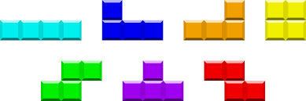

# PyTetrominoes
Daniel Park and CJ Hilty

## Topic

The topic of our project is to recreate the live puzzle-strategy game of Tetromino drop, also known as Tetris. The game chooses a tetromino (details below) at random, and places it at the top of a tall, 10 x 20 gameboard. The tetromino begins to fall towards the bottom, square by square. The player can move the tetromino left or right up to the gameboard's walls, rotate the tetromino clockwise, or manually push it down towards the floor of the gameboard. Once the tetromino touches the floor of the gameboard or the top of any other pieces, it is stuck in place. Another tetromino is chosen at random, and the player now controls that tetromino. As the tetrominoes stack up, the player can arrange them so that they fit together. When an entire 10-squre row of the gameboard is filled, the squares of the tetrominos on that row disappear and any pieces above that row drop down to fill their place. When 10 rows are cleared, the game level increases, and the pieces start falling faster.

### About Tetrominoes
Tetrominoes (a play on words of the greek prefix *tetra* (meaning "four") and *dominoes*) are a set of straightforward shapes that are made out of basic squares attached side by side. They are the basic units of our tetromino stacking game.

*Tetris strategists call these pieces the I-block, J-block, L-block, O-block, S-block, T-block and Z-block.*

## Interactivity

The user will use the left and right arrow keys to move the tetrominoes. The up and down arrow keys will be used to rotate the piece clockwise and allow the player to push the piece down when they have it in position. We are using PyGame to make the GUI for our control architecture.

## Model

The model will consist of classes for the board, the tetrominoes, and the game score. The model will handle placing the tetrominoes, choosing the next piece, detecting and removing completed lines, scoring the game, and detecting when the player loses.

### Scoring

The score will be calculated by the game model. In our tetromino game, players earn points for placing blocks and clearing lines. The game will add ten points every time a piece is placed, as well as the following points for clearing different numbers of lines:

**1 Row** | **2 Rows** | **3 Rows** | **4 Rows**\*
--- | --- | --- | ---
40×(*level*+1) | 100×(*level*+1) | 300×(*level*+1) | 1200×(*level*+1)

\*If there is a full "TETRIS" (four lines of blocks are cleared at the same time), then 100 additional points will be given.

## View

During the game, the player will be able to see:
* the game board and existing pieces.
* the current falling piece,
* their score and the game level, and
* the next piece.

Each of these views will consist of a class that interacts with PyGame.

## Controller
# PyTetrominoes
Daniel Park and CJ Hilty

## Topic

The topic of our project is to recreate the live puzzle-strategy game of Tetromino drop, also known as Tetris. The game chooses a tetromino (details below) at random, and places it at the top of a tall, 10 x 20 gameboard. The tetromino begins to fall towards the bottom, square by square. The player can move the tetromino left or right up to the gameboard's walls, rotate the tetromino clockwise, or manually push it down towards the floor of the gameboard. Once the tetromino touches the floor of the gameboard or the top of any other pieces, it is stuck in place. Another tetromino is chosen at random, and the player now controls that tetromino. As the tetrominoes stack up, the player can arrange them so that they fit together. When an entire 10-squre row of the gameboard is filled, the squares of the tetrominos on that row disappear and any pieces above that row drop down to fill their place. When 10 rows are cleared, the game level increases, and the pieces start falling faster.

### About Tetrominoes
Tetrominoes (a play on words of the greek prefix *tetra* (meaning "four") and *dominoes*) are a set of straightforward shapes that are made out of basic squares attached side by side. They are the basic units of our tetromino stacking game.

*Tetris strategists call these pieces the I-block, J-block, L-block, O-block, S-block, T-block and Z-block.*

## Interactivity

The user will use the left and right arrow keys to move the tetrominoes. The up and down arrow keys will be used to rotate the piece clockwise and allow the player to push the piece down when they have it in position. We are using PyGame to make the GUI for our control architecture.

## Model

The model will consist of classes for the board, the tetrominoes, and the game score. The model will handle placing the tetrominoes, choosing the next piece, detecting and removing completed lines, scoring the game, and detecting when the player loses.

### Scoring

The score will be calculated by the game model. In our tetromino game, players earn points for placing blocks and clearing lines. The game will add ten points every time a piece is placed, as well as the following points for clearing different numbers of lines:

**1 Row** | **2 Rows** | **3 Rows** | **4 Rows**\*
--- | --- | --- | ---
40×(*level*+1) | 100×(*level*+1) | 300×(*level*+1) | 1200×(*level*+1)

\*If there is a full "TETRIS" (four lines of blocks are cleared at the same time), then 100 additional points will be given.

## View

During the game, the player will be able to see:
* the game board and the current falling piece,
* their score
* the game level, and
* the next piece.

Each of these views will consist of a class that interacts with PyGame.

## Controller

The user is providing input using their arrow keys to move the block up, down, left, and right. There will be a class to use use input code from PyGame to get input.